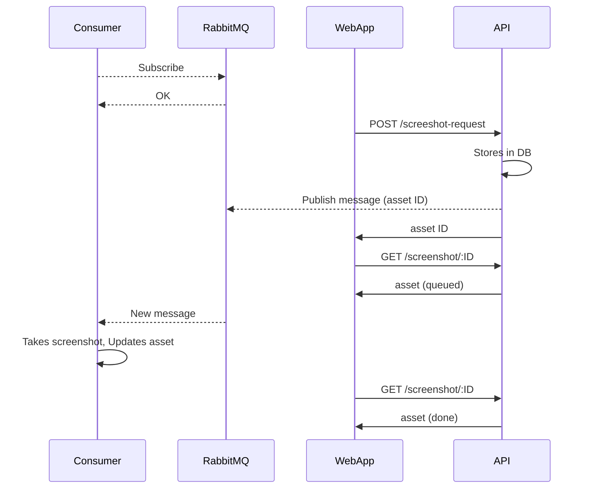

# Yakkyo fullstack test

## Introduction

Hello! Thank you for your interest in working with us. We don't believe in subjecting candidates to tasks like creating a vertical order traversal in a binary tree or ~~crap~~ impractical questions like that. Instead, we prefer to present a simplified version of our stack and observe how you can address a typical and practical issue/feature.

Feel free to utilize any library, information source, or material you need. The primary objective of this exercise is to acquaint you with our stack and assess how you approach and resolve new challenges.

## 🧐 What is it in this repo?

- `client`: a [Vue.js](https://vuejs.org/) 2.7 app with [Pinia](https://pinia.vuejs.org/), Vite and [Vuetify](https://vuetifyjs.com/en/)/[Tailwind](https://tailwindcss.com/) support - `port: 8080 `
- `server`: NodeJS & ExpressJS Server for our APIs - `port: 3000`
- `consumer`: NodeJS consumer app listening to RabbitMQ
- `models`: MongoDB models used throughout the monorepo
- `types`: TS types and declarations used throughout the monorepo

## 🫡 What to do?

1. **Fork** this repo into your own account.

2. **Containerize** the application by creating a `docker-compose.yml` that manages all the services (_client_, _server_, _consumer_, _MongoDB_, _RabbitMQ server_) for seamless local development and execution.

3. Establish a **Mongoose Schema** for an asset named _screenshot_, including fields for storing a URL (string), a file (BLOB, Buffer, or Base64 String - your choice), and a status enum with values _queued_, _processing_, and _done_.

4. **Develop a POST endpoint** that receives and validates a request body containing a URL. Store the URL in the _Screenshot_ model, setting its status to _queued_. Additionally, this controller should publish a message to RabbitMQ with the new asset's ID as payload and respond to the API request with the same ID.

5. **Develop a GET endpoint** that accepts a screenshot ID as a URL parameter and responds with the corresponding asset.

6. Enhance the _client_ by **adding a view** with a text input and a button. Upon clicking the button, the view should initiate an API call to the new POST endpoint. Store the ID from the response in localStorage and inform the user that the task has been queued. Periodically, the view should make API calls to the new GET endpoint every 5 seconds. If the asset's status becomes _done_, display the image, and flush the localStorage. Note: Reloading the page during result waiting should not disrupt the application.

7. Modify the consumer to actively **listen to the queue**. Upon receiving a new message, extract the ID, query MongoDB to retrieve the asset, obtain the URL, and capture a screenshot of the website using a common library such as [Puppeteer](https://www.npmjs.com/package/puppeteer). If capturing the screenshot poses challenges, you may simulate this step by providing a placeholder image.

Anything else is up to you! Simultaneous screenshot support? Caching? Compression? Have fun with it!

## UML diagram

This is how all the elements should interact:

## 🤖 Guidelines on Using AI Tools

We encourage candidates to leverage AI tools to enhance productivity, such as summarizing documentation or assisting with simple code autocompletion. However, this test is designed to assess your personal skills, creativity, and problem-solving abilities. Please refrain from using AI to generate entire code sections or solve major parts of the test. Be aware that we may analyze the repository for fingerprints from common AI models to detect excessive or inappropriate AI usage, which could impact the evaluation of your submission. Above all, we value originality and your unique approach.

## 🥳 What to do when you are done?

After completing the task, please update your repository. Even though you are working independently during this exercise, make an effort to be diligent with your commits and messages. We would like to observe how you handle version control. Include a concise README with instructions on how to run the application, and feel free to add any personal comments if necessary. Additionally, provide information on the time taken to complete the task and mention any difficulties encountered, if applicable.

Please send the public repository URL to domingo@yakkyo.com and alessandro.centanni@yakkyo.com.

Best of luck!

P.S.: At Yakkyo, you won't be working in isolation; you're part of a collaborative team of developers eager to support one another 💪. Therefore, even during this test, feel encouraged to reach out if you have any uncertainties about the task.
